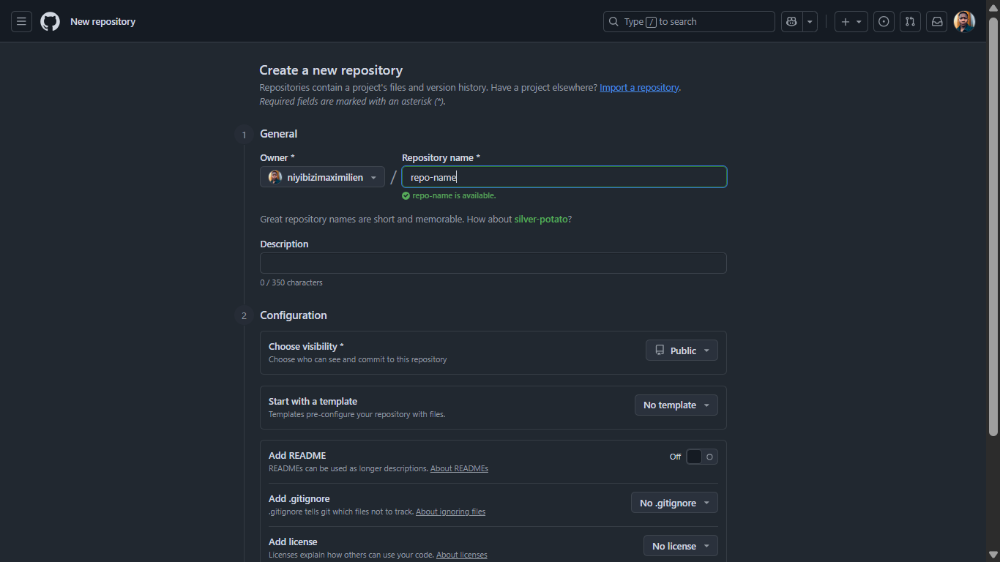
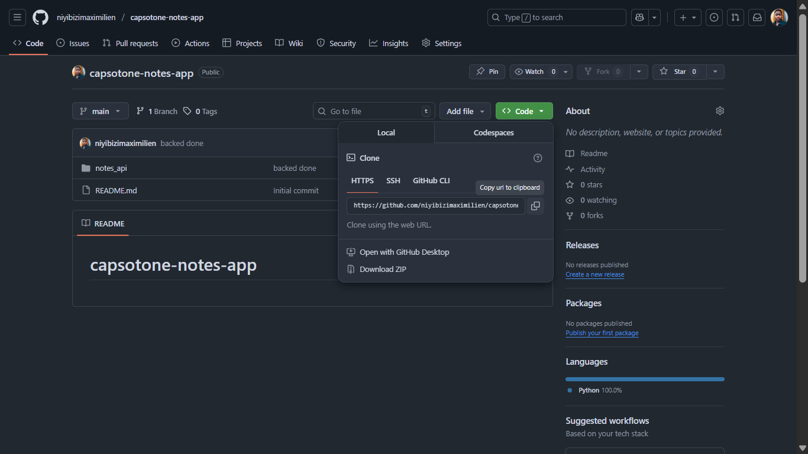

# this is a simple study website
by this file you can read all infos related to this project
# we need to know github basic commands used while in collaboration with peaple.

the best thing you need to know is that when you start a project 

# git init => this is about to help the gitbash in your laptop to access the files you write in that folder where you want github to track.
when you type git init then the git will then add a .git folder in your working folder. this is where all the codes you write, the changes, additions, deletions,...etc.

the next thing after allowing the git initialisation in your project folder is to make sure that the place where you want to put the codes from your local computer to the public (online) so that other peaple can easly access it. 

# make the github repository as the normal ways: 

# git remote add orgin #repo-name
 ========================================

 # the above steps are followed when you start your project manually on your local computer. if you already had a repo on you own github you can just write: 

# git clone #the-link
like this one : 

# after you did some changes and then you want to put them online, then if you are in collabolation with more peaple you do like this:

# 1) git add .  => this one help you to let git bash know the change you have made after you scince the last commit(the last time you put on github.)

# git status => this help you to see if you added the correct files.

# git commit -m "--the message you want--"  => this help the git to know that you want to send some files to github so it prepares the path to pass through.

# git pull  => scince you know you are in collabo, you are working with more peaple maybe the have put files in the or changes on github while you was busy with your work, the type that command it will then load all the other works they did so that you are not left behind.

# git push  => finally this one ends the game, it is the one that puts the codes you have written to the branch you are working on.

you can practice those above cmds.
